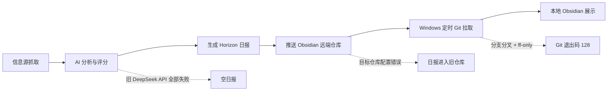

# {{ENTRY_NUMBER}}

## Horizon 日报恢复与 Obsidian 自动同步：一次端到端排障复盘

日期：2026-08-24

范围：GitHub Actions、LLM 中转 API、Git 仓库同步、Obsidian、Windows 任务计划程序

### 一句话结论

这次问题不是单点故障，而是三段链路同时存在隐患：旧 AI 接口全部失败却被降级逻辑掩盖、日报被推送到错误的 Obsidian 仓库、本地计划任务又因 Git 分支分叉而拒绝拉取。最终通过证据驱动的分层排查，恢复了日报生成、远端同步和本地每日拉取。

### 故障链路



### 问题、证据与修复

| 阶段 | 表象 | 关键证据 | 根因 | 修复 |
|---|---|---|---|---|
| 历史日报回填 | 本地看不到历史文件 | 回填任务显示 171 份日报已处理，但本地仓库没有变化 | 日报推送到了旧仓库 `obsidian_cloud` | 改为 `Yancy-gate/obsidian-jiudebuqu-xindebulai`，重新回填 |
| 本地同步 | 远端已有，本地仍没有 | 手动 `git pull` 后新增 147 份文件 | 本地仓库没有及时拉取远端 `master` | 为实际 vault 配置每日自动拉取 |
| 8 月 18 日后的空日报 | 抓取约 200 条，却显示“没有达到阈值” | 8 月 18 日 174/174 条 AI 分析失败；8 月 19 日 226/226 条失败 | 旧 DeepSeek API 返回错误，代码把失败项静默记为 0 分 | 切换 Lumohub `gpt-5.6-sol`，增加失败率保护 |
| API 切换 | 需要兼容 OpenAI 协议 | `/v1/models` 返回 401，证明 `/v1` 是受鉴权保护的兼容入口；最小 completion 测试成功 | Base URL、模型名和 Secret 必须同时正确 | 使用 `https://api.lumohub.pro/v1`、`gpt-5.6-sol`、`LUMOHUB_API_KEY` |
| 假成功保护 | API 全挂时工作流仍为绿色 | 旧日志中所有分析调用失败，但仍保存 673 字节空日报 | 单条异常被捕获后没有批次级失败判断 | AI 失败率超过 20% 时终止工作流 |
| 性能 | 单并发完整日报耗时约 35 分钟 | 192 条分析加 36 条富化顺序执行 | 分析和富化并发均为 1 | 并发提高到 6，目标约 5 分钟 |
| Windows 定时任务 | 任务存在但文件没更新 | `LastTaskResult = 128`；Git 提示无法 fast-forward | 本地 Obsidian 提交与远端日报提交形成分叉 | 使用 `pull --rebase --autostash` |

### 最终配置

| 配置项 | 最终值 | 设计理由 |
|---|---|---|
| AI Provider | OpenAI-compatible | 复用 Horizon 现有客户端 |
| Base URL | `https://api.lumohub.pro/v1` | 中转站的 OpenAI 兼容入口 |
| Model | `gpt-5.6-sol` | 用户指定模型 |
| Secret | `LUMOHUB_API_KEY` | 密钥只放 GitHub Actions Secrets |
| 模型回退 | 无 | 失败必须暴露，避免静默使用其他模型 |
| 分析并发 | 6 | 在吞吐与中转站限流风险间折中 |
| 富化并发 | 6 | 缩短第二阶段耗时 |
| 最大 AI 失败率 | 20% | 超过阈值即停止生成 |
| Obsidian 远端 | `obsidian-jiudebuqu-xindebulai` | 与实际本地 vault 对应 |
| 本地 vault | `D:\Data\旧的不去新的不来` | 当前使用中的 Obsidian 库 |
| 自动拉取时间 | 每天 12:00 | 日报已在早晨生成，预留充足缓冲 |
| Git 拉取策略 | `pull --rebase --autostash` | 保留本地编辑并接入远端日报提交 |

### 最终验证证据

| 验证项 | 结果 |
|---|---|
| Lumohub 最小 API 请求 | 成功 |
| Horizon 全量测试 | 全部通过 |
| 2026-08-23 修复后重跑 | 192 条完成分析，0 条 AI 失败 |
| 达到 5.0 分阈值 | 97 条 |
| 最终精选与富化 | 36 条 |
| 2026-08-23 Obsidian 更新 | 818 行新增、16 行删除 |
| 2026-08-24 自动日报 | 213 条完成分析，108 条达标，精选 36 条 |
| 历史回填到实际 vault | 共 171 份，新增 147 份、保留 24 份 |
| Windows 任务 | 每天 12:00，状态 `Ready` |

### 关键命令

手动同步当前 Obsidian 库：

```powershell
git -C "D:\Data\旧的不去新的不来" pull --rebase --autostash origin master
```

立即运行计划任务：

```powershell
Start-ScheduledTask -TaskName "Horizon Obsidian Daily Pull"
```

检查计划任务结果：

```powershell
Get-ScheduledTaskInfo "Horizon Obsidian Daily Pull" |
  Select-Object LastRunTime, LastTaskResult, NextRunTime
```

`LastTaskResult` 为 `0` 表示成功；`128` 通常表示 Git 致命错误，应手动执行同一条 Git 命令查看详细原因。

### 工程方法总结

1. 先按“生成、远端同步、本地拉取、客户端展示”拆分链路，不把“看不到文件”笼统归因于 Obsidian。
2. 用运行日志、提交 SHA、文件数量和退出码建立证据链，再修改配置。
3. 对批处理系统设置失败比例门槛，避免大量失败被逐条降级后产生“成功”的假象。
4. 自动化 Git 同步必须考虑本地编辑；`--ff-only` 适合只读副本，不适合会产生本地提交的 Obsidian vault。
5. Secret 只存于 GitHub Actions Secrets；泄露后的密钥必须撤销，不能继续写入配置。

### 可用于简历的项目表述

> 设计并修复一套基于 GitHub Actions、OpenAI 兼容 LLM API、Git 与 Obsidian 的自动化技术情报流水线。通过日志与提交级证据定位 AI API 全量失败、错误仓库路由和 Git 分支分叉三类故障；引入 20% 批次失败熔断、6 路并发分析、历史日报幂等回填及 Windows 定时 rebase 同步，使日报从抓取、分析、生成到本地知识库交付形成可验证的闭环。

### 面试展开要点

| 面试问题 | 回答主线 |
|---|---|
| 如何定位跨系统故障？ | 按数据流拆段，用每段的输入、输出、日志和提交验证边界 |
| 为什么不能只降低评分阈值？ | 所有 AI 调用都失败，评分为 0 是异常降级结果，不是真实低价值 |
| 为什么增加失败率门槛？ | 防止逐条容错掩盖系统性故障，避免生成误导性产物 |
| 为什么不用 `git reset --hard`？ | 会破坏 Obsidian 本地编辑；rebase + autostash 能保留修改 |
| 如何处理性能问题？ | 先用单并发验证正确性，再在通过真实 API 测试后提高到 6 路并发 |

## .raw Wikilink 表

| 类型 | Wikilink | 用途 |
|---|---|---|
| 当日日报 | [[其他/内参日报/horizon-2026-08-24-zh]] | 查看修复后的自动日报 |
| 前一日重跑 | [[其他/内参日报/horizon-2026-08-23-zh]] | 对比空日报修复前后差异 |
| 每日学习入口 | [[其他/每日自主学习/2026-08-24]] | 本复盘的复习入口 |

## Wiki source/entity 表

| 关系 | Source | Entity | 说明 |
|---|---|---|---|
| generated-by | [[Horizon]] | [[Horizon 日报]] | 多源信息抓取、评分与摘要生成 |
| analyzed-by | [[Lumohub]] | [[GPT-5.6 Sol]] | OpenAI 兼容文本分析模型 |
| automated-by | [[GitHub Actions]] | [[日报流水线]] | 定时生成并推送日报 |
| stored-in | [[Git]] | [[Obsidian]] | 远端版本管理与本地知识库 |
| scheduled-by | [[Windows 任务计划程序]] | [[Horizon Obsidian Daily Pull]] | 每天 12:00 自动拉取 |

## 可读核心要点

| 核心概念 | 记忆句 |
|---|---|
| 链路排障 | 看不到结果时，逐段验证生成、推送、拉取、展示 |
| 假成功 | 单条容错不能掩盖批次级系统故障 |
| 幂等回填 | 只补缺、不覆盖，降低历史数据修复风险 |
| Git 同步 | 可编辑工作区优先 rebase + autostash，不强制覆盖 |
| Secret 安全 | 密钥不入库，泄露即撤销 |
| 性能调优 | 正确性验证后再提高并发，并保留失败率保护 |

## 复习路径

1. 先看“故障链路”图，用 1 分钟复述三个根因。
2. 再看“问题、证据与修复”表，区分现象、证据和根因。
3. 手写两条关键命令：手动 Git 同步、检查计划任务结果。
4. 用“可用于简历的项目表述”做 90 秒项目介绍。
5. 一周后回答“面试展开要点”中的五个问题。

## 解决问题涉及的知识点

### 1. 端到端数据链路与边界验证

自动化系统要按数据流拆成可独立验证的边界：

| 边界 | 输入 | 输出 | 验证方法 |
|---|---|---|---|
| 抓取 | RSS、GitHub、HN 等信息源 | `ContentItem` 集合 | 日志中的抓取数量与来源分布 |
| AI 分析 | 标题、正文、元数据 | 分数、摘要、标签 | 成功数、失败数、分数分布 |
| 摘要生成 | 通过阈值的条目 | Markdown 日报 | 文件日期、行数、精选数量 |
| 远端同步 | Markdown 文件 | Obsidian Git 提交 | commit SHA、目标仓库、变更文件 |
| 本地拉取 | 远端 `master` | 本地 vault 文件 | Git 退出码与目标文件是否存在 |
| Obsidian 展示 | 本地 Markdown | 文件树和阅读视图 | vault 路径与索引刷新 |

核心原则：不要从最终界面的异常直接猜根因；先找到“最后一个正确边界”和“第一个错误边界”。

### 2. OpenAI 兼容 API

“兼容 OpenAI”通常表示服务实现了类似 `/v1/chat/completions` 的请求协议，但仍需分别验证：

1. Base URL 是否包含 `/v1`。
2. 模型名是否是中转站实际暴露的名称。
3. 是否支持 `response_format={"type":"json_object"}`。
4. 使用 `max_tokens` 还是 `max_completion_tokens`。
5. 是否接受 `temperature`。
6. HTTP 401 表示端点存在但缺少或拒绝鉴权；404 更可能是路径错误。

最小 smoke test 应只发送一个固定 JSON 请求，先验证密钥、路径、模型和返回格式，再运行数百条内容的完整任务。

### 3. GitHub Actions Secrets

Secret 与普通配置的职责不同：

| 类型 | 示例 | 是否进入仓库 |
|---|---|---|
| 非敏感配置 | Base URL、模型名、并发数 | 可以 |
| Secret 名称 | `LUMOHUB_API_KEY` | 可以 |
| Secret 值 | `sk-...` | 绝不能 |

工作流通过 `${{ secrets.LUMOHUB_API_KEY }}` 注入环境变量，程序再读取 `LUMOHUB_API_KEY`。密钥一旦出现在聊天、日志或提交历史中，就应立即撤销并重新生成。

### 4. 批处理失败率与熔断

逐条捕获异常可以保证个别失败不拖垮整个批次，但会产生新的风险：当 API 全部失效时，每条记录都被降级为 0 分，流水线仍可能生成“没有重要内容”的假成功。

失败率定义：

```text
failure_ratio = failed_items / total_items
```

本项目设置：

```text
failure_ratio > 20%  =>  终止任务
failure_ratio <= 20% =>  允许少量异常并继续
```

这属于批次级熔断。它同时保留了局部容错能力和系统性故障的可见性。

### 5. 并发、吞吐与限流

单并发便于验证正确性，但总耗时近似为：

```text
总耗时 ≈ 请求数 × 单次平均延迟
```

提高并发后，理想耗时近似为：

```text
总耗时 ≈ 请求数 × 单次平均延迟 / 并发数
```

实际还会受到服务端并发上限、429 限流、网络抖动和富化阶段耗时影响。正确调优顺序是：

1. 单请求 smoke test。
2. 单并发完整任务。
3. 逐步提高并发。
4. 观察 429、5xx、失败率和总耗时。
5. 保留指数退避与批次失败率门槛。

本次从并发 1 提高到 6，是吞吐与中转站稳定性的折中，不应只追求理论最短时间。

### 6. 幂等设计

幂等表示同一操作执行多次，最终结果仍与执行一次一致。

本次用到的幂等策略：

- 历史日报：目标文件存在就跳过，只补缺。
- 学习日志：先检查固定标题，存在则不重复追加。
- Git 提交：`git diff --staged --quiet` 时不创建空提交。
- 定时任务：按固定任务名使用 `-Force` 更新，不重复创建。

自动化任务可能因重试、网络恢复或人工误触重复执行，因此幂等不是优化项，而是安全基础。

### 7. Git 分支分叉

当本地与远端都产生新提交时，历史形成分叉：

```text
      L1  本地提交
     /
A---B
     \
      R1  远端日报提交
```

`git pull --ff-only` 只允许指针直接前移，遇到分叉会以退出码 128 终止。它适合纯只读副本，但不适合会产生本地提交的 Obsidian vault。

本项目采用：

```powershell
git pull --rebase --autostash origin master
```

- `--rebase`：把本地提交重放到最新远端提交之后，保持线性历史。
- `--autostash`：临时保存未提交修改，rebase 后自动恢复。
- 若双方修改同一位置，仍可能发生冲突；自动化任务应失败并保留现场，而不是强制覆盖。

### 8. Git 退出码与可观测性

Windows 任务计划程序的 `LastTaskResult` 保存进程退出码：

| 结果 | 常见含义 |
|---|---|
| `0` | 成功 |
| `1` | 一般错误 |
| `128` | Git 致命错误，例如分支分叉、仓库路径错误、鉴权失败 |

计划任务只显示退出码时，应在交互式 PowerShell 中执行完全相同的命令，并加 `2>&1` 获取标准错误：

```powershell
git -C "D:\Data\旧的不去新的不来" pull --rebase --autostash origin master 2>&1
```

### 9. Windows 任务计划程序

稳定的无人值守任务至少要明确：

- 执行程序的绝对路径。
- 参数中的中文路径需要双引号。
- 运行身份应能读取 Git 凭据和本地 vault。
- 设置 `StartWhenAvailable`，电脑在计划时间关机时可补跑。
- 允许电池供电时运行。
- 使用固定任务名，便于查询和更新。
- 用 `LastRunTime`、`LastTaskResult`、`NextRunTime` 验证。

任务状态 `Ready` 表示已注册并等待触发，不表示刚刚执行成功。

### 10. 时区与日期一致性

GitHub Actions 使用 UTC，而日报文件按 `Asia/Shanghai` 命名。若直接使用 runner 的系统日期，在 UTC 午夜附近会得到错误日期。

统一做法：

```bash
TZ=Asia/Shanghai date +'%Y-%m-%d'
```

生成、远端文件名、Obsidian 路径和每日学习入口必须使用同一时区，否则会出现“任务成功但当天文件不存在”的错觉。

### 11. 可观测性与验证证据

“任务绿色”不等于业务成功。完整验证应至少包括：

1. 工作流结论为 success。
2. AI 分析失败数为 0 或低于门槛。
3. 达标条目数与最终精选数合理。
4. 日报文件不是固定大小的空模板。
5. Obsidian 目标仓库出现新 commit。
6. 本地 `git pull` 返回 0。
7. 目标路径存在当天文件。

把这些指标写入日志，可以把“感觉修好了”升级为“有证据证明修好了”。
