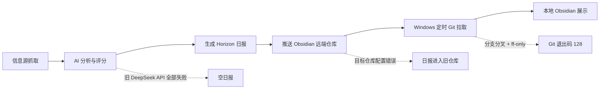

# {{ENTRY_NUMBER}}

## Horizon 日报恢复与 Obsidian 自动同步：一次端到端排障复盘

日期：2026-08-24

范围：GitHub Actions、LLM 中转 API、Git 仓库同步、Obsidian、Windows 任务计划程序

### 一句话结论

这次问题不是单点故障，而是三段链路同时存在隐患：旧 AI 接口全部失败却被降级逻辑掩盖、日报被推送到错误的 Obsidian 仓库、本地计划任务又因 Git 分支分叉而拒绝拉取。最终通过证据驱动的分层排查，恢复了日报生成、远端同步和本地每日拉取。

### 故障链路



### 问题、证据与修复

| 阶段 | 表象 | 关键证据 | 根因 | 修复 |
|---|---|---|---|---|
| 历史日报回填 | 本地看不到历史文件 | 回填任务显示 171 份日报已处理，但本地仓库没有变化 | 日报推送到了旧仓库 `obsidian_cloud` | 改为 `Yancy-gate/obsidian-jiudebuqu-xindebulai`，重新回填 |
| 本地同步 | 远端已有，本地仍没有 | 手动 `git pull` 后新增 147 份文件 | 本地仓库没有及时拉取远端 `master` | 为实际 vault 配置每日自动拉取 |
| 8 月 18 日后的空日报 | 抓取约 200 条，却显示“没有达到阈值” | 8 月 18 日 174/174 条 AI 分析失败；8 月 19 日 226/226 条失败 | 旧 DeepSeek API 返回错误，代码把失败项静默记为 0 分 | 切换 Lumohub `gpt-5.6-sol`，增加失败率保护 |
| API 切换 | 需要兼容 OpenAI 协议 | `/v1/models` 返回 401，证明 `/v1` 是受鉴权保护的兼容入口；最小 completion 测试成功 | Base URL、模型名和 Secret 必须同时正确 | 使用 `https://api.lumohub.pro/v1`、`gpt-5.6-sol`、`LUMOHUB_API_KEY` |
| 假成功保护 | API 全挂时工作流仍为绿色 | 旧日志中所有分析调用失败，但仍保存 673 字节空日报 | 单条异常被捕获后没有批次级失败判断 | AI 失败率超过 20% 时终止工作流 |
| 性能 | 单并发完整日报耗时约 35 分钟 | 192 条分析加 36 条富化顺序执行 | 分析和富化并发均为 1 | 并发提高到 6，目标约 5 分钟 |
| Windows 定时任务 | 任务存在但文件没更新 | `LastTaskResult = 128`；Git 提示无法 fast-forward | 本地 Obsidian 提交与远端日报提交形成分叉 | 使用 `pull --rebase --autostash` |

### 最终配置

| 配置项 | 最终值 | 设计理由 |
|---|---|---|
| AI Provider | OpenAI-compatible | 复用 Horizon 现有客户端 |
| Base URL | `https://api.lumohub.pro/v1` | 中转站的 OpenAI 兼容入口 |
| Model | `gpt-5.6-sol` | 用户指定模型 |
| Secret | `LUMOHUB_API_KEY` | 密钥只放 GitHub Actions Secrets |
| 模型回退 | 无 | 失败必须暴露，避免静默使用其他模型 |
| 分析并发 | 6 | 在吞吐与中转站限流风险间折中 |
| 富化并发 | 6 | 缩短第二阶段耗时 |
| 最大 AI 失败率 | 20% | 超过阈值即停止生成 |
| Obsidian 远端 | `obsidian-jiudebuqu-xindebulai` | 与实际本地 vault 对应 |
| 本地 vault | `D:\Data\旧的不去新的不来` | 当前使用中的 Obsidian 库 |
| 自动拉取时间 | 每天 12:00 | 日报已在早晨生成，预留充足缓冲 |
| Git 拉取策略 | `pull --rebase --autostash` | 保留本地编辑并接入远端日报提交 |

### 最终验证证据

| 验证项 | 结果 |
|---|---|
| Lumohub 最小 API 请求 | 成功 |
| Horizon 全量测试 | 全部通过 |
| 2026-08-23 修复后重跑 | 192 条完成分析，0 条 AI 失败 |
| 达到 5.0 分阈值 | 97 条 |
| 最终精选与富化 | 36 条 |
| 2026-08-23 Obsidian 更新 | 818 行新增、16 行删除 |
| 2026-08-24 自动日报 | 213 条完成分析，108 条达标，精选 36 条 |
| 历史回填到实际 vault | 共 171 份，新增 147 份、保留 24 份 |
| Windows 任务 | 每天 12:00，状态 `Ready` |

### 关键命令

手动同步当前 Obsidian 库：

```powershell
git -C "D:\Data\旧的不去新的不来" pull --rebase --autostash origin master
```

立即运行计划任务：

```powershell
Start-ScheduledTask -TaskName "Horizon Obsidian Daily Pull"
```

检查计划任务结果：

```powershell
Get-ScheduledTaskInfo "Horizon Obsidian Daily Pull" |
  Select-Object LastRunTime, LastTaskResult, NextRunTime
```

`LastTaskResult` 为 `0` 表示成功；`128` 通常表示 Git 致命错误，应手动执行同一条 Git 命令查看详细原因。

### 工程方法总结

1. 先按“生成、远端同步、本地拉取、客户端展示”拆分链路，不把“看不到文件”笼统归因于 Obsidian。
2. 用运行日志、提交 SHA、文件数量和退出码建立证据链，再修改配置。
3. 对批处理系统设置失败比例门槛，避免大量失败被逐条降级后产生“成功”的假象。
4. 自动化 Git 同步必须考虑本地编辑；`--ff-only` 适合只读副本，不适合会产生本地提交的 Obsidian vault。
5. Secret 只存于 GitHub Actions Secrets；泄露后的密钥必须撤销，不能继续写入配置。

### 可用于简历的项目表述

> 设计并修复一套基于 GitHub Actions、OpenAI 兼容 LLM API、Git 与 Obsidian 的自动化技术情报流水线。通过日志与提交级证据定位 AI API 全量失败、错误仓库路由和 Git 分支分叉三类故障；引入 20% 批次失败熔断、6 路并发分析、历史日报幂等回填及 Windows 定时 rebase 同步，使日报从抓取、分析、生成到本地知识库交付形成可验证的闭环。

### 面试展开要点

| 面试问题 | 回答主线 |
|---|---|
| 如何定位跨系统故障？ | 按数据流拆段，用每段的输入、输出、日志和提交验证边界 |
| 为什么不能只降低评分阈值？ | 所有 AI 调用都失败，评分为 0 是异常降级结果，不是真实低价值 |
| 为什么增加失败率门槛？ | 防止逐条容错掩盖系统性故障，避免生成误导性产物 |
| 为什么不用 `git reset --hard`？ | 会破坏 Obsidian 本地编辑；rebase + autostash 能保留修改 |
| 如何处理性能问题？ | 先用单并发验证正确性，再在通过真实 API 测试后提高到 6 路并发 |

## .raw Wikilink 表

| 类型 | Wikilink | 用途 |
|---|---|---|
| 当日日报 | [[其他/内参日报/horizon-2026-08-24-zh]] | 查看修复后的自动日报 |
| 前一日重跑 | [[其他/内参日报/horizon-2026-08-23-zh]] | 对比空日报修复前后差异 |
| 每日学习入口 | [[其他/每日自主学习/2026-08-24]] | 本复盘的复习入口 |

## Wiki source/entity 表

| 关系 | Source | Entity | 说明 |
|---|---|---|---|
| generated-by | [[Horizon]] | [[Horizon 日报]] | 多源信息抓取、评分与摘要生成 |
| analyzed-by | [[Lumohub]] | [[GPT-5.6 Sol]] | OpenAI 兼容文本分析模型 |
| automated-by | [[GitHub Actions]] | [[日报流水线]] | 定时生成并推送日报 |
| stored-in | [[Git]] | [[Obsidian]] | 远端版本管理与本地知识库 |
| scheduled-by | [[Windows 任务计划程序]] | [[Horizon Obsidian Daily Pull]] | 每天 12:00 自动拉取 |

## 可读核心要点

| 核心概念 | 记忆句 |
|---|---|
| 链路排障 | 看不到结果时，逐段验证生成、推送、拉取、展示 |
| 假成功 | 单条容错不能掩盖批次级系统故障 |
| 幂等回填 | 只补缺、不覆盖，降低历史数据修复风险 |
| Git 同步 | 可编辑工作区优先 rebase + autostash，不强制覆盖 |
| Secret 安全 | 密钥不入库，泄露即撤销 |
| 性能调优 | 正确性验证后再提高并发，并保留失败率保护 |

## 复习路径

1. 先看“故障链路”图，用 1 分钟复述三个根因。
2. 再看“问题、证据与修复”表，区分现象、证据和根因。
3. 手写两条关键命令：手动 Git 同步、检查计划任务结果。
4. 用“可用于简历的项目表述”做 90 秒项目介绍。
5. 一周后回答“面试展开要点”中的五个问题。
